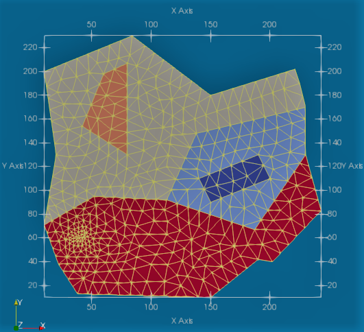

[](http://www.repostatus.org/#active)
[](https://github.com/PetrKryslUCSD/Targe2.jl/actions)

# Targe2.jl

Constrained triangulation of arbitrary two-dimensional regions.



`Targe2.jl` implements an interface to the C-language program
Targe2 for advancing-front triangulation of two-dimensional regions
with arbitrary boundaries and vertex and curve constraints.
The complete sources are available from [http://hogwarts.ucsd.edu/~pkrysl/software.html](http://hogwarts.ucsd.edu/~pkrysl/software.html).

The author would appreciate if issues and suggestions were reported. 
Please don't hesitate to e-mail pkrysl@ucsd.edu.
 
## Get Targe2.jl
 
```
Pkg.clone("https://github.com/PetrKryslUCSD/Targe2.jl")
```

## Testing

```
Pkg.test("Targe2")
```

## Usage

Examples of inputs can be found in the `srcoftests.jl`  source file 
in the test folder. 

The User's Guide in PDF form is available in the "doc" folder.

 
