[](http://www.repostatus.org/#active)
[](https://github.com/PetrKryslUCSD/Targe2.jl/actions)

# Targe2.jl

Constrained triangulation of arbitrary two-dimensional regions.

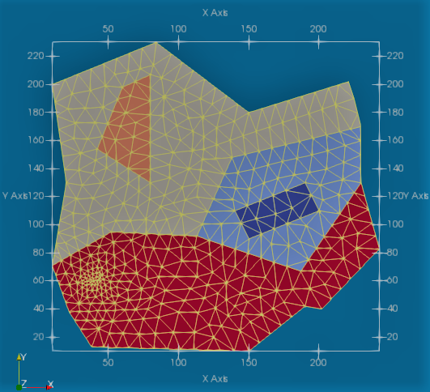

`Targe2.jl` implements an interface to the C-language program
Targe2 for advancing-front triangulation of two-dimensional regions
with arbitrary boundaries and vertex and curve constraints.
The complete sources are available from [http://hogwarts.ucsd.edu/~pkrysl/software.html](http://hogwarts.ucsd.edu/~pkrysl/software.html).

The author would appreciate if issues and suggestions were reported. 
Please don't hesitate to e-mail pkrysl@ucsd.edu.
 
## Get Targe2.jl
 
```
Pkg.clone("https://github.com/PetrKryslUCSD/Targe2.jl")
```

Executables are currently available for Windows 10, 11, and Linux.
The executable for the Mac is currently broken.

## Testing

```
Pkg.test("Targe2")
```

## Usage

Tutorials can be found below.
Examples of inputs can be found in the `srcoftests.jl`  source file 
in the test folder. Also check out the `samples` folder with input files.

## Documentation

The User's Guide in PDF form is available in the "doc" folder.

## Tutorials

The visualization software `Paraview` (http://www.paraview.org/) needs to be installed in order to visualize the meshes.

Change directory to the `demos` subfolder of `Targe2` package. Activate and instantiate as
```
using Revise; using Pkg; Pkg.activate("."); Pkg.instantiate();
```

Then execute this line:
```
using demos 
```

*Warning*: 
The command input to the `Targe2` executable has been debugged in the tutorials
below. Please not that the program will fail if the inputs are unreasonable,
for instance when the boundary curves intersect, or when they have incorrect
orientations. No checks that the inputs are rational are  performed: the
program will simply try to generate the mesh, and if it can't, the mesh
generation will fail. In some cases silently.

### Coarse mesh of a rectangle

A really simple example is this uniform mesh of a rectangle. 

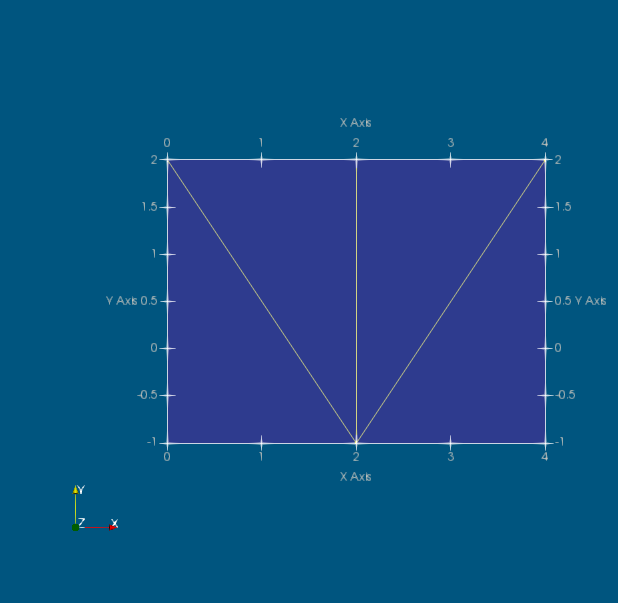

Select this code and execute in Julia. 
```
demo("rectangle-uniform", """
curve 1 line 0 -1 4 -1
curve 2 line 4 -1  4 2 
curve 3 line 4 2  0 2  
curve 4 line 0 2  0 -1
subregion 1  property 1 boundary 1 2 3 4
m-ctl-point constant 2.5
""", show = true);
```

The `show = true` argument will cause a post processing file to be written out
and handed off to Paraview to be displayed. Note that the Paraview will only
start if it is in the `Path`. The `.vtu` file will be written irrespectively.
Its name will be `"rectangle-uniform.vtu"` in this case.

The key to the input of the definition of the region for the triangulation is to
realize that each subregion needs to be circumscribed with curves that are
traversed counterclockwise while keeping the subregion to the left. Each line
segment (`curve 1 line ...` and so on) has an orientation given by the order in which its
endpoints are listed. For instance, curve 1 is a line segment from the XY
coordinates `(0, -1)` to the coordinates `(4, -1)`.

Since all line curves are given so that they are traversed counterclockwise in
their positive sense, the boundary consists of the list of the curves with
positive signs (i.e. `1 2 3 4`).

If we assign the result of the `demo` call to the variable `mesh` as
```
mesh = demo("rectangle-uniform", """
curve 1 line 0 -1 4 -1
curve 2 line 4 -1  4 2 
curve 3 line 4 2  0 2  
curve 4 line 0 2  0 -1
subregion 1  property 1 boundary 1 2 3 4
m-ctl-point constant 2.5
""", show = true);
```
we receive the `mesh` data structure (named tuple). The data structure looks like this:
```
julia> mesh
(xy = [0.0 -1.0; 2.0 -1.0; … ; 2.0 2.0; 0.0 2.0], triconn = [1 2 6; 2 3 4; 4 5 2; 5 6 2], trigroups = Array{Int64,1}[[1, 2, 3, 4]], edgeconn = [1 2; 2 3; … ; 2 4; 2 5], edgegroups = Array{Int64,1}[[1, 2], [3], [4, 5], [6]]) 
```

There is only a single group of triangles (i. e. a single subregion, per the
specifications), and for each edge (curve) there is one group of mesh edges. The
connectivity arrays point into the array of vertex coordinates, `mesh.xy`.
So for instance, edge 2 connects vertices 2 and 3.

### Finer mesh on a rectangle

To refine the mesh we generated above is easy: we will define the "constant"
(uniform) element size to be smaller. Now result will be as shown here.

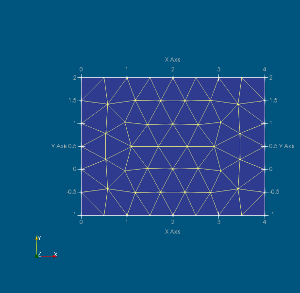

Select this code and execute in Julia. 
```
mesh = demo("rectangle-uniform-finer", """
curve 1 line 0 -1 4 -1
curve 2 line 4 -1  4 2 
curve 3 line 4 2  0 2  
curve 4 line 0 2  0 -1
subregion 1  property 1 boundary 1 2 3 4
m-ctl-point constant 0.5
""", show = true);
```

There are now 86 triangles:
```
julia> size(mesh.triconn)      
(86, 3)          
```


### Mesh of a rectangle with a circular hole

We will introduce a hole in the middle of the rectangle, of circular shape and
radius 0.75. We will also make the elements smaller with a factor of two.

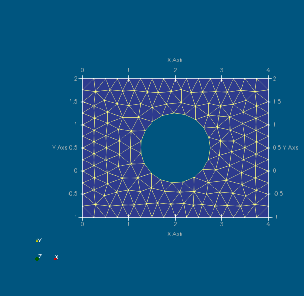

Select this code and execute in Julia. 
```
demo("rectangle-uniform-hole", """
curve 1 line 0 -1 4 -1
curve 2 line 4 -1  4 2 
curve 3 line 4 2  0 2  
curve 4 line 0 2  0 -1
curve 5 circle center 2 $((2 + -1)/2.0) radius 0.75
subregion 1  property 1 boundary 1 2 3 4 hole -5
m-ctl-point constant 0.25
""", show = true);
```

Note that the hole is made by referring to the boundary of the circle with a
negative sign. The boundary of a hole needs to be traversed clockwise. Recall
that when traversing the boundary of a subregion, the subregion needs to be on
the left hand side. The circular curve is by convention positive when it is
traversed in the counterclockwise direction, so in order to create a hole we
need to list it with a negative sign (`-5`): Then when traversing that curve we
have the bounded subregion on the left hand side. 

### Mesh of a rectangle with a filled circular subregion

Now we will fill the hole with a second subregion (rendered in red).

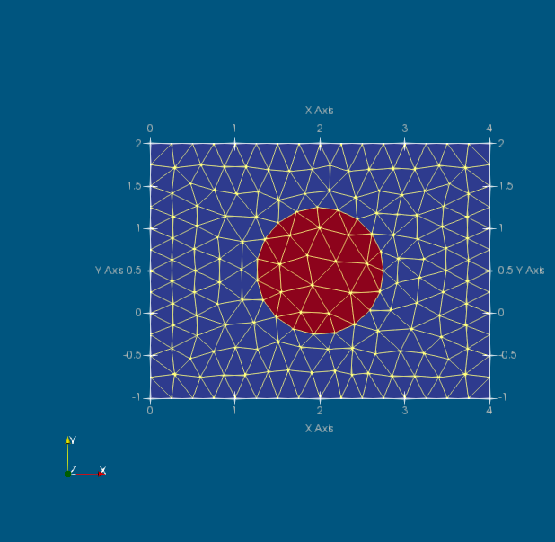

Select this code and execute in Julia. 
```
demo("rectangle-uniform-2", """
curve 1 line 0 -1 4 -1
curve 2 line 4 -1  4 2 
curve 3 line 4 2  0 2  
curve 4 line 0 2  0 -1
curve 5 circle center 2 $((2 + -1)/2.0) radius 0.75
subregion 1  property 1 boundary 1 2 3 4 hole -5
subregion 2  property 2 boundary 5
m-ctl-point constant 0.25
""", show = true);
```

This requires two `subregion` commands, each with its own boundary.
Note that the circle curve (`5`) is used twice: once with a negative sign to define a hole in the first subregion, and once with a positive sign to define the second subregion which fills the hole in the first subregion. 

### Mesh of three subregions

In this example we can add a third subregion to the left of the first subregion. 

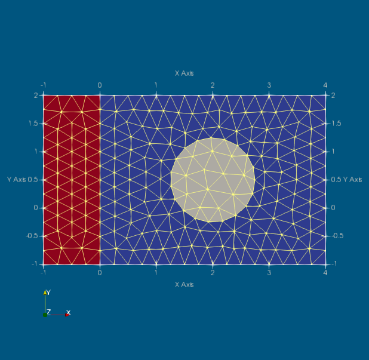

We add three line curves, but note that in order to traverse the boundary of the
third subregion counterclockwise, we need to refer to some of these curves with
a negative identifier. 

The previously defined curve `4` is reused for the definition of subregion 3,
and in this case it needs to be referenced as `-4`. Note that in order to make
the subregions contiguous, the curve 4 needs to be reused. We can certainly
create a new curve to connect the very same endpoints, but then the subregions
would not be connected together.

Select this code and execute in Julia. 
```
mesh = demo("rectangle-uniform-3", """
curve 1 line 0 -1 4 -1
curve 2 line 4 -1  4 2 
curve 3 line 4 2  0 2  
curve 4 line 0 2  0 -1
curve 5 circle center 2 $((2 + -1)/2.0) radius 0.75
curve 11 line 0 -1 -1 -1
curve 12 line -1 -1 -1 2
curve 23 line 0 2 -1 2
subregion 1  property 1 boundary 1 2 3 4 hole -5
subregion 2  property 2 boundary 5
subregion 3  property 3 boundary -12 -11 23 -4
m-ctl-point constant 0.25
""", show = true);
```

The colors obviously refer to the numerical identifiers of the subregions (call for the color legend in the figure). Also we may note here that the numbering of the curves is arbitrary as long as the identifiers of the curves are unique.

The mesh data structure is
```
julia> mesh                                                                                                 
(xy = [0.00000e+00 -1.00000e+00; 2.50000e-01 -1.00000e+00; … ; -5.00630e-01 1.24854e+00; -5.00429e-01 1.51756e+00], triconn = [57 76 58; 58 77 59; … ; 232 233 223; 241 225 224], trigroups = [[1, 2, 3, 4, 5, 6, 7, 8, 
9, 10  …  278, 279, 280, 281, 282, 283, 284, 285, 286, 287], [288, 289, 290, 291, 292, 293, 294, 295, 296, 297  …  319, 320, 321, 322, 323, 324, 325, 326, 327, 328], [329, 330, 331, 332, 333, 334, 335, 336, 337, 338 
 …  407, 408, 409, 410, 411, 412, 413, 414, 415, 416]], edgeconn = [1 2; 2 3; … ; 241 225; 224 241], edgegroups = [[1, 2, 3, 4, 5, 6, 7, 8, 9, 10, 11, 12, 13, 14, 15, 16], [17, 18, 19, 20, 21, 22, 23, 24, 25, 26, 27, 28], [29, 30, 31, 32, 33, 34, 35, 36, 37, 38, 39, 40, 41, 42, 43, 44], [45, 46, 47, 48, 49, 50, 51, 52, 53, 54, 55, 56], [57, 58, 59, 60, 61, 62, 63, 64, 65, 66, 67, 68, 69, 70, 71, 72, 73, 74, 75], Int64[], Int64[], Int64[], Int64[], Int64[]  …  Int64[], Int64[], Int64[], Int64[], Int64[], Int64[], Int64[], Int64[], Int64[], [537, 538, 539, 540]])   
 ```
and can be parsed as follows. The triangles are listed irrespectively of their subregions.
that the triangles can be assigned to subregions based on the `trigroups`:
```
julia> size(mesh.trigroups)      
(3,)         
``` 
Triangles of the subregion 2 are
```
julia> mesh.trigroups[2]                                                                                    
41-element Vector{Int64}:                                                                                   
 288                    
 289 
 290 
 …   
 328                                                                                                                                                                                                          
julia> 
```
The numbers (identifiers) of the mesh edges of the curve 23 are
```
julia> mesh.edgegroups[23]                                                                                  
4-element Vector{Int64}:                                                                                    
 537   
 538
 539
 540
  
julia> 
```
so that their connectivity can be retrieved as
```
julia> mesh.edgeconn[mesh.edgegroups[23], :]            
4×2 Matrix{Int64}:                                                                                          
  45 210 
 210 211
 211 212
 212 206
       
julia> 
```

### Mesh of two regions with nodes on a given curve

It is possible to enforce the presence of certain features.

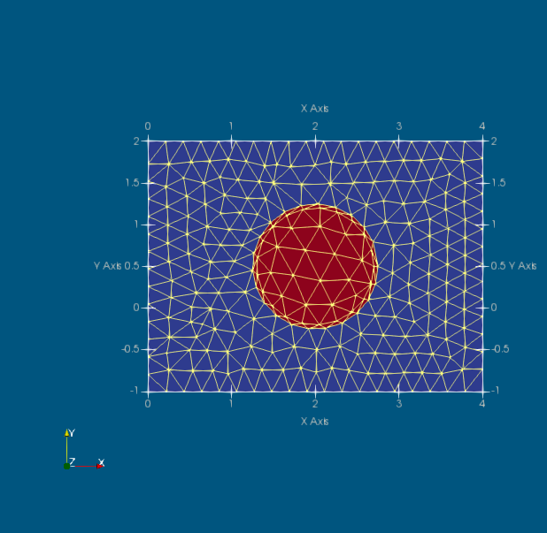

We can enforce the location of nodes on some curves. For instance here we
enforce the presence of an additional circle inside the circular subregion 2.
And we also enforce the presence of an inclined straight line in subregion 1.
This is accomplished by embedding a curve inside the domain with both the
positive and negative orientation (curves 7 and 40). In this way the curve is
incorporated in the domain triangulation: there is no crack, the triangulation
is continuous along the curve from both sides. 

Select this code and execute in Julia. 
```
demo("rectangle-uniform-2-c", """
curve 1 line 0 -1 4 -1
curve 2 line 4 -1  4 2 
curve 3 line 4 2  0 2  
curve 4 line 0 2  0 -1
curve 5 circle center 2 $((2 + -1)/2.0) radius 0.75
curve 7 circle center 2 $((2 + -1)/2.0) radius 0.7
curve 40 line 0.5 -0.5  1.5 1.5
subregion 1  property 1 boundary 1 2 3 4 40 -40 hole -5
subregion 2  property 2 boundary 5 7 -7
m-ctl-point constant 0.21
""", show = true);
```


### Graded mesh of a rectangle with a filled circular subregion

Here we show the mesh of two subregions, the circular one enclosed by the rectangular one, covered with a graded mesh. The mesh is graded towards the center of the circular subregion.

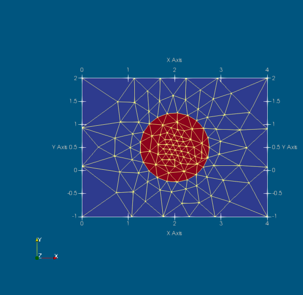

Select this code and execute in Julia. 
```
demo("rectangle-graded-2", """
curve 1 line 0 -1 4 -1
curve 2 line 4 -1  4 2 
curve 3 line 4 2  0 2  
curve 4 line 0 2  0 -1
curve 5 circle center 2 $((2 + -1)/2.0) radius 0.75
subregion 1  property 1 boundary 1 2 3 4 hole -5
subregion 2  property 2 boundary 5
m-ctl-point 1 xy 2 $((2 + -1)/2.0) near 0.05 influence 0.15
m-ctl-point constant 3.0
""", show = true);
```

The command `m-ctl-point 1 ...` sets the element size to be generated in the
vicinity of the location of the point `(2, $((2 + -1)/2.0))=(2, 0.5)` to 0.05,
within roughly the region of radius equal to 0.15. Elsewhere, transition in the
element size should be made to 3.0 far away from the centre of the circle.


### Mesh of region with a crack

It is possible to generate mathematically sharp cracks.

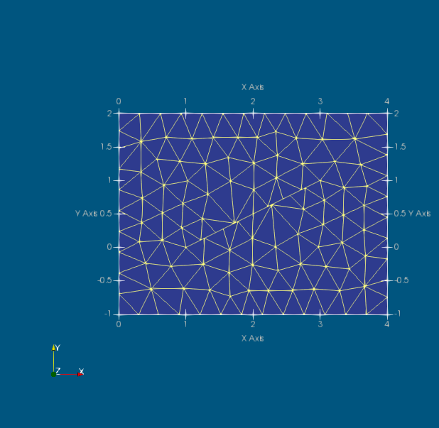

Select this code and execute in Julia. 
```
demo("rectangle-uniform-slit", """
curve 1 line 0 -1 4 -1
curve 2 line 4 -1  4 2 
curve 3 line 4 2  0 2  
curve 4 line 0 2  0 -1
curve 40 line  1 0 2 0.501
curve 41 line  2 0.501 3. 1. 
curve 42 line  3. 1.  2 0.499
curve 43 line  2 0.499 1 0
subregion 1  property 1 boundary 1 2 3 4 hole 40 41 42 43
m-ctl-point constant 0.31
""", show = true);
```

Notice that the lines 40, 41, 42, 43 form nearly a straight line. In fact the
hole defined by these lines does not have a zero area, just nearly so. Note
that it is not possible to have the crack define by just two straight line
segments: it leads to ambiguity, and the meshing fails.


### Mesh of region with a Rounded slit

Here we show mesh generation in a slightly more complicated domain, with
circular arcs and line segments for the boundary.

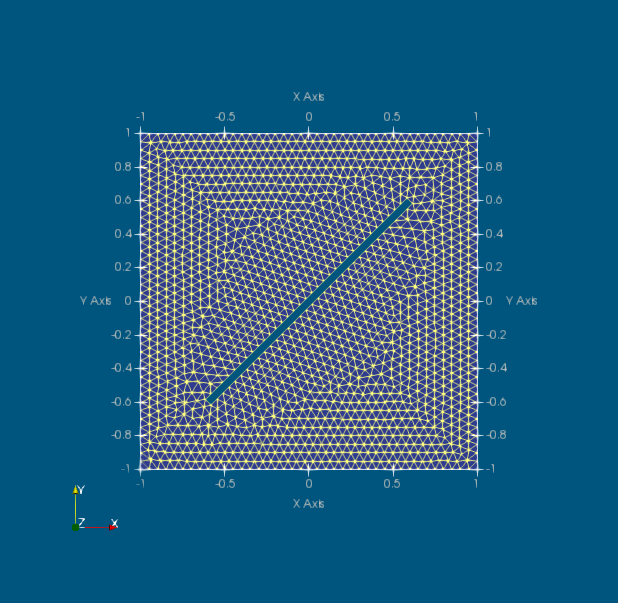

Select this code and execute in Julia. 
```
let
a, b, w = 1.0, 0.6, 0.025
cb, sw = b * 0.999, sqrt(2.0)/2 * w
demo("rectangle-uniform-rounded-slit", """
curve 1 line $(-a) $(-a) $(+a) $(-a)
curve 2 line $(+a) $(-a) $(+a) $(+a)
curve 3 line $(+a) $(+a) $(-a) $(+a)
curve 4 line $(-a) $(+a) $(-a) $(-a)
curve 40 arc $(-b+sw) $(-b-sw) $(-b-sw) $(-b+sw) center $(-cb) $(-cb) 
curve 41 arc $(+b-sw) $(+b+sw) $(+b+sw) $(+b-sw) center $(+cb) $(+cb) 
curve 42 line $(+b+sw) $(+b-sw) $(-b+sw) $(-b-sw)
curve 43 line $(-b-sw) $(-b+sw) $(+b-sw) $(+b+sw)
subregion 1  property 1 boundary 1 2 3 4 hole 40 41 42 43
m-ctl-point constant 0.05
""", show = true);
end
```
Notice that the mesh-control uniform element size specification of 0.5
forces generation of a single element across the arcs at the ends of the slit.


### Graded mesh of region with a Rounded slit

The above example is repeated with a graded mesh around the arcs at the end of the slit. 

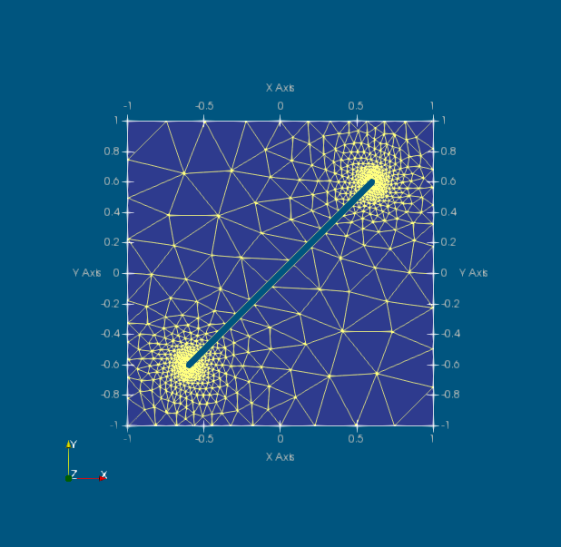

Select this code and execute in Julia. 
```
let
a, b, w = 1.0, 0.6, 0.025
cb, sw = b * 0.999, sqrt(2.0)/2 * w
demo("rectangle-graded-rounded-slit", """
curve 1 line $(-a) $(-a) $(+a) $(-a)
curve 2 line $(+a) $(-a) $(+a) $(+a)
curve 3 line $(+a) $(+a) $(-a) $(+a)
curve 4 line $(-a) $(+a) $(-a) $(-a)
curve 40 arc $(-b+sw) $(-b-sw) $(-b-sw) $(-b+sw) center $(-cb) $(-cb) 
curve 41 arc $(+b-sw) $(+b+sw) $(+b+sw) $(+b-sw) center $(+cb) $(+cb) 
curve 42 line $(+b+sw) $(+b-sw) $(-b+sw) $(-b-sw)
curve 43 line $(-b-sw) $(-b+sw) $(+b-sw) $(+b+sw)
subregion 1  property 1 boundary 1 2 3 4 hole 40 41 42 43
m-ctl-point constant $(a/2)
m-ctl-point 1 xy $(-cb) $(-cb) near $(w/5) influence $(w)
m-ctl-point 2 xy $(+cb) $(+cb) near $(w/5) influence $(w)
""", show = true);
end
```

### Mesh of a flange

```
let
Re, Ri, rh = 70.0, 40.0, 5.0 # external, internal, bolt hole radius
rb = (Re+Ri)/2
h = rh/5
nh = 7
demo("flange-uniform", 
    string("""
       curve 10 circle center 0 0 radius $(Re)                                                                                                                                                                                       
       curve 20 circle center 0 0 radius $(Ri)                                                                                                                                                                                       
       """, 
       ["curve $i circle center $(cos(2*pi/nh*(i-1))*rb) $(sin(2*pi/nh*(i-1))*rb) radius $(rh)\n" for i in 1:nh]...
       )   * """
        subregion 1  property 1 boundary 10 hole -20 $([string(-i) * " " for i in 1:nh]...)
        m-ctl-point constant $(h)
        """, show = true);
end

```
 
