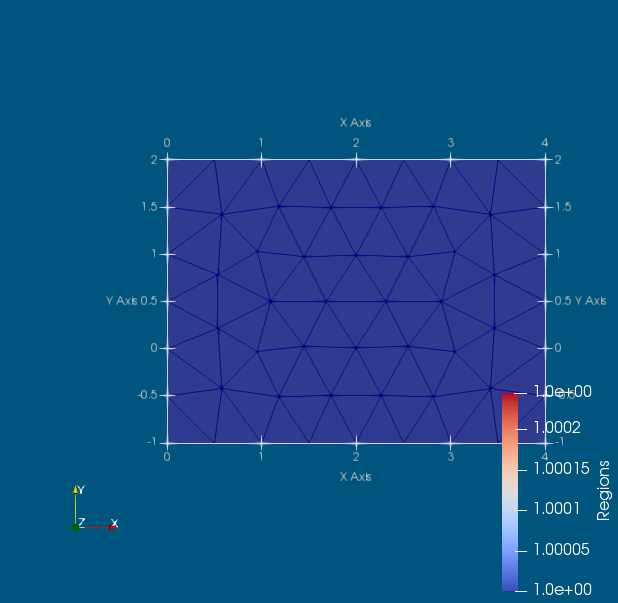
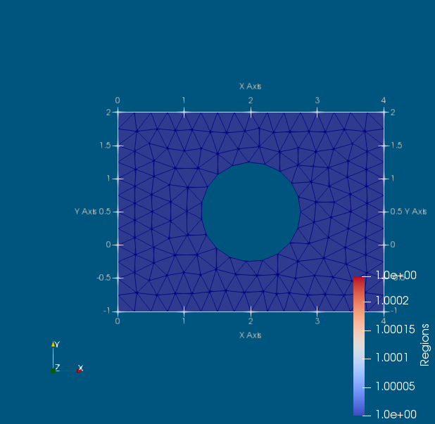

# Gallery of Targe2 meshes

The examples here assume that you have the `Targe2` package and its dependencies installed. Also, the visualization software `Paraview` (http://www.paraview.org/) needs to be installed in order to visualize the meshes.

First execute these two lines:
```
using Targe2 
using Targe2: demo
```

A really simple example is this uniform mesh of a rectangle. Select this code and execute in Julia. You should get a picture like the one below.
```
demo("rectangle-uniform", """
curve 1 line 0 -1 4 -1
curve 2 line 4 -1  4 2 
curve 3 line 4 2  0 2  
curve 4 line 0 2  0 -1
subregion 1  property 1 boundary 1 2 3 4
m-ctl-point constant 2.5
""", show = true);
```


If we assign the result of the `demo` call to the variable `mesh` as
```
mesh = demo("rectangle-uniform", """
curve 1 line 0 -1 4 -1
curve 2 line 4 -1  4 2 
curve 3 line 4 2  0 2  
curve 4 line 0 2  0 -1
subregion 1  property 1 boundary 1 2 3 4
m-ctl-point constant 2.5
""", show = true);
```
we receive the `mesh` data structure (named tuple). The data structure looks like this:
```
julia> mesh
(xy = [0.0 -1.0; 2.0 -1.0; … ; 2.0 2.0; 0.0 2.0], triconn = [1 2 6; 2 3 4; 4 5 2; 5 6 2], trigroups = Array{Int64,1}[[1, 2, 3, 4]], edgeconn = [1 2; 2 3; … ; 2 4; 2 5], edgegroups = Array{Int64,1}[[1, 2], [3], [4, 5], [6]]) 
```
There is only a single group of triangles (i. e. a single subregion, per the specifications), and for each edge (curve) there is one group of edges. The connectivity array point into the array of vertex coordinates, `mesh.xy`.

To refine the mesh is easy: we will define the "constant" (uniform) element size to be smaller.
```
demo("rectangle-uniform-finer", """
curve 1 line 0 -1 4 -1
curve 2 line 4 -1  4 2 
curve 3 line 4 2  0 2  
curve 4 line 0 2  0 -1
subregion 1  property 1 boundary 1 2 3 4
m-ctl-point constant 0.5
""", show = true);
```


We will introduce a hole in the middle of the rectangle, of circular shape and radius 0.75. We will also make the elements smaller with a factor of two.
```
demo("rectangle-uniform-hole", """
curve 1 line 0 -1 4 -1
curve 2 line 4 -1  4 2 
curve 3 line 4 2  0 2  
curve 4 line 0 2  0 -1
curve 5 circle center 2 $((2 + -1)/2.0) radius 0.75
subregion 1  property 1 boundary 1 2 3 4 hole -5
m-ctl-point constant 0.25
""", show = true);
```

