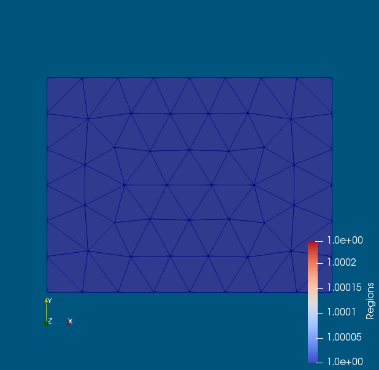

# Gallery of Targe2 meshes

```
using Targe2 
using Targe2: demo
demo("rectangle-uniform", """
curve 1 line 0 -1 4 -1
curve 2 line 4 -1  4 2 
curve 3 line 4 2  0 2  
curve 4 line 0 2  0 -1
subregion 1  property 1 boundary 1 2 3 4
m-ctl-point constant 0.5
""")
```

 